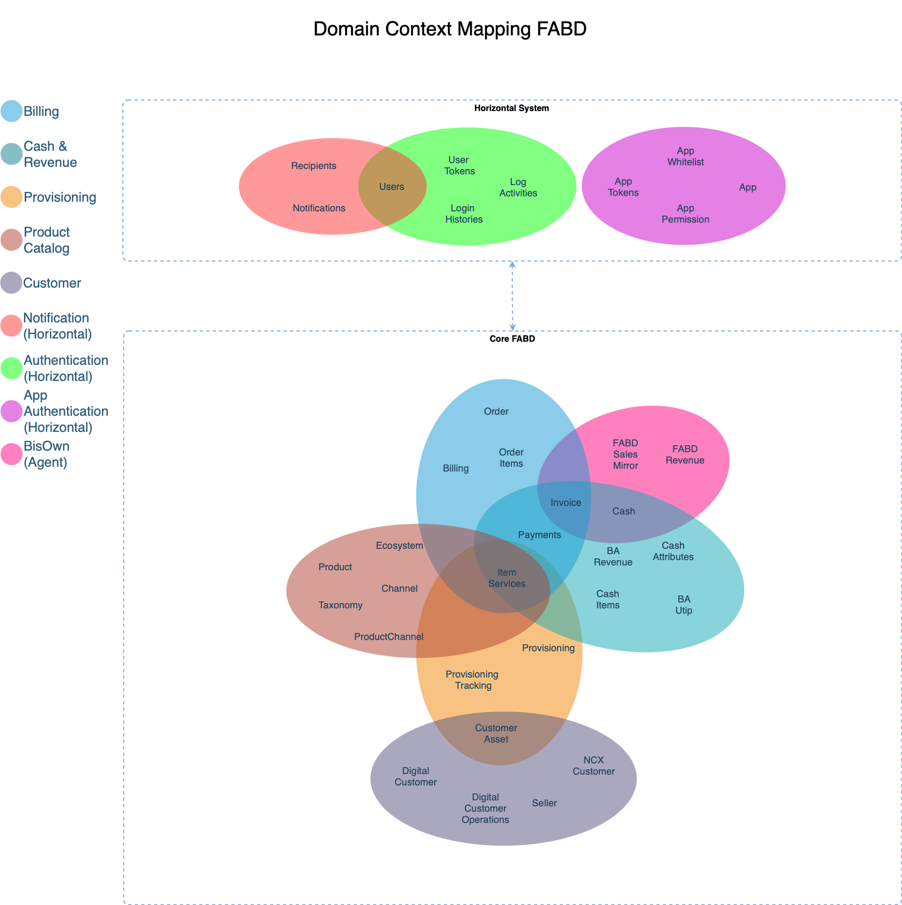

# 📘 Knowledge Sharing: API Design Best Practices

## 🔧 Integrating Microsoft API Guidelines + Google AIP + Telkom AIP-style

---

### 1. 📐 Design Principles

Desain API yang baik adalah fondasi dari keberhasilan integrasi sistem, skalabilitas, dan adopsi developer. Prinsip desain ini memastikan bahwa API konsisten, mudah digunakan, dan dapat berkembang tanpa merusak konsumen yang sudah ada.

**Telkom AIP-001: Design Philosophy**

* APIs must serve internal and external developers equally.
* Favor declarative over imperative interaction.
* Avoid complex nested payloads; prioritize clarity over compactness.
* 💡 *Use Case:* API untuk verifikasi user sebaiknya tidak memerlukan proses berlapis. Contoh: `GET /api/v1/identity/users/me` langsung mengembalikan profil user berdasarkan token.

**Referensi:**

* Microsoft: Mendorong keseragaman desain di seluruh API dengan prinsip "API-first" dan fokus pada dokumentasi awal, konsistensi URL, dan kontrak antarmuka yang tidak berubah.
* Google AIP:

  * [AIP-121](https://google.aip.dev/121): Mempromosikan prinsip resource-oriented design agar API terasa konsisten dan terstruktur.
  * [AIP-133](https://google.aip.dev/133): Mendefinisikan praktik yang memastikan perubahan bersifat backward-compatible.
  * [AIP-141](https://google.aip.dev/141): Menetapkan konvensi penamaan standar di seluruh API.

---

### 2. 🌍 Resource Design

Desain resource menentukan bagaimana pengguna berinteraksi dengan entitas dalam sistem. Tujuannya adalah menciptakan struktur URL yang intuitif dan mencerminkan hierarki data secara natural.

**Telkom AIP-002: URI Convention**

* Base URI: `/api/v{version}/{service}/{resource}`
* Example: `/api/v1/identity/users/{id}`
* 💡 *Use Case:* Mengakses order milik pelanggan: `GET /api/v1/commerce/customers/123/orders/456`

**Referensi:**

* Microsoft: Mengedepankan URI noun-based dengan struktur hierarkis untuk mencerminkan relasi entitas, seperti `/users/{userId}/orders`.
* Google AIP:

  * [AIP-122](https://google.aip.dev/122): Mendorong penggunaan struktur resource yang hierarkis dan dapat dikenali.
  * [AIP-123](https://google.aip.dev/123): Menjelaskan standar format penamaan resource secara konsisten.

---

### 3. 📦 Versioning

Versioning API penting untuk memastikan pengembangan fitur baru dan penghapusan fitur lama dilakukan tanpa mengganggu konsumen yang masih menggunakan versi sebelumnya.

**Telkom AIP-003: Versioning Rule**

* Mandatory version prefix in URI.
* Deprecated versions must be sunset with 6-month notice.
* 💡 *Use Case:* Versi pertama API pelanggan: `GET /api/v1/customer-service/customers`

**Referensi:**

* Microsoft: Menyarankan versioning di path URI seperti `/v1.0` dan menghindari breaking changes.
* Google AIP: [AIP-181](https://google.aip.dev/181): Menetapkan bahwa semua API harus memiliki versi eksplisit yang konsisten dalam URI atau header.

---

### 4. 📨 Methods and HTTP Semantics

Penggunaan metode HTTP yang tepat membantu membuat API lebih prediktif dan sesuai standar REST.

**Telkom AIP-004: HTTP Verb Semantics**

* `PATCH` is preferred over `PUT` for partial updates.
* `POST` must not be used for non-idempotent mutations unless `request_id` is used.
* 💡 *Use Case:* `PATCH /api/v1/identity/users/123` untuk update nama atau status saja.

**Referensi:**

* Microsoft: Menekankan penggunaan semantik HTTP sesuai dengan CRUD dan memastikan prediktabilitas pada setiap metode.
* Google AIP: [AIP-131](https://google.aip.dev/131): Menyediakan panduan eksplisit tentang pemetaan metode HTTP terhadap operasi API.

---

### 5. 🔄 Error Handling

Format penanganan error harus jelas, terstruktur, dan memberi informasi yang cukup bagi developer untuk menangani kegagalan.

**Telkom AIP-005: Error Standard**

```json
{
  "error": {
    "code": 403,
    "message": "Forbidden: Access denied.",
    "domain": "identity",
    "reason": "INSUFFICIENT_PERMISSION",
    "metadata": {
      "user_id": "abc123"
    }
  }
}
```

* 💡 *Use Case:* Respon gagal akses endpoint internal: `GET /api/v1/hr/employees/123`

**Referensi:**

* Microsoft: Mengadopsi struktur error dengan elemen `code`, `message`, dan `details` yang mudah dibaca dan ditindaklanjuti.
* Google AIP: [AIP-193](https://google.aip.dev/193): Menstandarisasi penanganan error menggunakan `google.rpc.Status` dengan format seragam di seluruh API.

---

### 6. 🔍 Filtering, Paging, Sorting

Fitur ini mendukung efisiensi dalam pengambilan data dalam jumlah besar, serta memberikan fleksibilitas bagi pengguna dalam mendapatkan data yang dibutuhkan.

**Telkom AIP-006: Pagination and Filters**

* Use `limit`, `offset`, `sort_by`, `filter` query parameters.
* Example: `/api/v1/inventory/items?filter=type:modem&limit=50&offset=0`
* 💡 *Use Case:* `GET /api/v1/warehouse/stocks?filter=location:bdg&sort_by=expiry_date`

**Referensi:**

* Microsoft: Menggunakan gaya OData untuk filtering dan paging (`$filter`, `$top`, `$orderby`, dll).
* Google AIP: [AIP-160](https://google.aip.dev/160): Menetapkan pola `page_size`, `page_token`, dan konsistensi dalam paginasi.

---

### 7. 🔐 Authentication & Authorization

Keamanan adalah aspek utama dari API publik maupun internal. Mekanisme autentikasi dan otorisasi harus kuat, konsisten, dan terstandarisasi.

**Telkom AIP-007: Identity Enforcement**

* All endpoints must verify `X-Telkom-User-Id` from Gateway layer.
* Role info included in JWT claims.
* 💡 *Use Case:* `GET /api/v1/admin/audits` hanya dapat diakses oleh user dengan role `ADMIN_AUDITOR`

**Referensi:**

* Microsoft: Mendorong penerapan OAuth 2.0 dan kontrol berbasis peran (RBAC) di seluruh API.
* Google AIP: [AIP-4110](https://google.aip.dev/4110): Menjelaskan integrasi IAM dan enforcement policy berbasis role dan resource.

---

### 8. 🧪 Idempotency and Retry

API yang dapat diulang dengan aman (idempotent) penting untuk ketahanan sistem terutama pada kondisi jaringan yang tidak stabil.

**Telkom AIP-008: Retry Guarantee**

* All mutation requests must accept `X-Request-ID`.
* Backend must ensure deduplication based on ID.
* 💡 *Use Case:* `POST /api/v1/payment/transactions` dengan header `X-Request-ID: abc-123` akan menolak duplikasi jika ID sama dikirim ulang.

**Referensi:**

* Microsoft: Mendorong `PUT` dan `DELETE` sebagai idempotent dan aman untuk retrial.
* Google AIP: [AIP-152](https://google.aip.dev/152): Menyarankan penggunaan field `request_id` untuk menjamin idempotensi dalam permintaan ulang.

---

### 9. 📚 Naming Conventions

Konsistensi penamaan meningkatkan keterbacaan, prediktabilitas, dan mengurangi kebingungan dalam integrasi antar tim.

**Telkom AIP-009: Naming Style**

* snake\_case untuk semua field dalam payload.
* PascalCase hanya untuk definisi model/tipe.
* 💡 *Use Case:* Payload `POST /api/v1/identity/users`:

```json
{
  "first_name": "Budi",
  "last_name": "Santoso",
  "birth_date": "1990-01-01"
}
```

**Referensi:**

* Microsoft: Menyarankan camelCase untuk JSON field agar sejalan dengan konvensi umum JavaScript.
* Google AIP: [AIP-140](https://google.aip.dev/140): Menstandarisasi penggunaan snake\_case dalam penamaan field JSON.

---

### 10. 🧭 Documentation and Discovery

Dokumentasi adalah jembatan antara pengembang API dan pengguna. API tanpa dokumentasi = tidak berguna.

**Telkom AIP-010: Discovery Standards**

* All services must publish OpenAPI 3.0 spec to internal API registry.
* Use Redoc or Swagger UI for developer portal.
* 💡 *Use Case:* `GET /api/v1/discovery/openapi.json` menyediakan spesifikasi penuh API service.

**Referensi:**

* Microsoft: Menekankan pentingnya OpenAPI/Swagger untuk discoverability dan client generation.
* Google AIP: [AIP-158](https://google.aip.dev/158): Menyediakan panduan dokumentasi yang lengkap untuk konsumen API internal dan eksternal.

---

### 11. 📒 Contoh implementasi di FABD



Diagram di atas merupakan *Domain Context Mapping* untuk FABD, yang membantu mengelompokkan batasan domain berdasarkan layanan bisnis dan fungsi horizontal. Berdasarkan diagram tersebut, arsitektur API sebaiknya mengikuti struktur berikut:

#### 🏗️ Suggested API Architecture (Domain-based)

##### 1. Horizontal Services (Cross-Cutting)

* **Authentication** (green):

  * `/api/v1/auth/login-histories`
  * `/api/v1/auth/user-tokens`
  * `/api/v1/auth/log-activities`
* **App Authentication** (purple):

  * `/api/v1/app/whitelists`
  * `/api/v1/app/permissions`
  * `/api/v1/app/tokens`
* **Notification** (red):

  * `/api/v1/notifications/recipients`
  * `/api/v1/notifications/messages`

##### 2. Core FABD Services

* **Billing** (blue):

  * `/api/v1/billing/orders`
  * `/api/v1/billing/invoices`
  * `/api/v1/billing/payments`
* **Cash & Revenue** (pink):

  * `/api/v1/revenue/ba-revenue`
  * `/api/v1/revenue/ba-utlp`
  * `/api/v1/revenue/fabd-revenue`
* **Provisioning** (orange):

  * `/api/v1/provisioning/tracking`
  * `/api/v1/provisioning/item-services`
* **Product Catalog** (brown):

  * `/api/v1/products/ecosystem`
  * `/api/v1/products/channels`
  * `/api/v1/products/taxonomy`
* **Customer** (purple):

  * `/api/v1/customers/digital`
  * `/api/v1/customers/sellers`
  * `/api/v1/customers/assets`

Setiap endpoint ini diusulkan untuk mencerminkan *bounded context* dan integritas domain yang sesuai, dengan pendekatan modular dan RESTful resource naming. Dokumentasi, otorisasi, dan error handling tetap merujuk pada Telkom AIP-001 hingga AIP-010.

#### 📌 Tentang Versi di URI

Struktur URI /api/v1/<domain> menunjukkan bahwa v1 mewakili versi global dari API publik Telkom secara keseluruhan. Namun demikian:

Jika suatu domain memerlukan evolusi independen tanpa memengaruhi domain lain, versi dapat diterapkan secara spesifik per domain.

Contoh:

/api/v1/billing/orders → menggunakan versi global v1

/api/v2/provisioning/item-services → versi v2 hanya untuk domain provisioning

Gunakan pendekatan ini bila ada perubahan kontrak signifikan dan backward-incompatible di suatu domain, tanpa perlu menunggu versi besar global berikutnya.

---

## 📎 Summary and Next Steps

* Follow **Microsoft’s structural rigor**.
* Adopt **Google’s AIP precision** in design and standards.
* Implement **Telkom AIP** to tailor principles to our internal ecosystem.

For future reference, AIP-style documents should be maintained in a central internal Git repo: `git@telkom/api-guidelines.git` under `aip/` directory.
